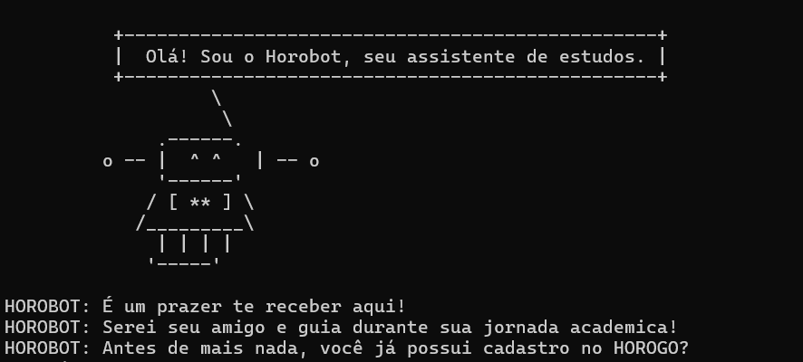
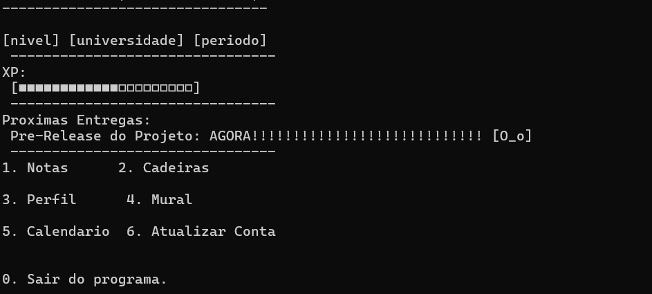

# 🤖 HOROGO - Assistente de Estudos Gamificado


**Transforme sua rotina acadêmica em uma aventura de RPG!**


---

## 📖 Sobre o Projeto

**HOROGO** é um gerenciador acadêmico desenvolvido em Python que combina organização de estudos com mecânicas de gamificação. Criado para a disciplina de **Projetos Interdisciplinares de Sistemas de Informação**, o projeto visa combater a procrastinação transformando tarefas acadêmicas em conquistas que geram recompensas.

**Inspirações:** Duolingo, Habitica  
**Diferencial:** Sistema completo de gestão acadêmica com XP, níveis e assistente interativo

---

## ⚡ Instalação Rápida

### Pré-requisitos
- Python 3.10 ou superior ([Download](https://www.python.org/downloads/))
- Git

### Passos

**1. Clone o repositório:**
```bash
git clone https://github.com/renatobbarros/Horogo.git
cd Horogo
```

**2. Execute o programa:**

**Windows:**
```bash
python app.py
```

**Linux/Mac:**
```bash
python3 app.py
```

✨ **Sem dependências externas!** Usa apenas bibliotecas padrão do Python.

---

## ✨ Funcionalidades Principais

### 🎓 Gestão Acadêmica Completa
- **Cadastro de Cadeiras:** Organize suas disciplinas por período
- **Gerenciamento de Notas:** VA1, VA2, VA3 e Recuperação
- **Cálculo Automático:** Média e situação (Aprovado/Reprovado)
- **Dashboard Intuitivo:** Visão geral do desempenho acadêmico



### 📅 Sistema de Calendário Inteligente
- **Tarefas:** Trabalhos, atividades e palestras
- **Datas Importantes:** Provas, entregas e eventos
- **Lembretes:** Próximas atividades no dashboard
- **Gestão Completa:** Adicionar, listar e marcar como concluído

### 🎮 Sistema de Gamificação

**Ganhe XP por:**
- 🔐 Login diário: **5 XP**
- 📚 Cadastrar cadeira: **10 XP**
- ✅ Concluir tarefa: **5-15 XP**
- 🎉 Participar de evento: **20 XP**

**Sistema de Níveis:**
- 15 níveis progressivos
- Barra de progresso visual
- Feedback do Horobot ao subir de nível



### 🗓️ Mural de Eventos Sociais
- **Criar Eventos:** Compartilhe atividades com outros usuários
- **Check-in:** Confirme participação em eventos
- **Informações Completas:** Título, descrição, data, local e participantes

### 🤖 Horobot - Seu Assistente Pessoal
- Mascote interativo com ASCII art
- Mensagens motivacionais
- Feedback constante sobre progresso
- Guia amigável em todas as funcionalidades


### 💾 Persistência de Dados
- Salvamento automático em JSON
- Backup local de dados
- Criação automática de diretórios
- Zero perda de informações

---

## 🏗️ Arquitetura do Sistema

```
HOROGO/
├── models/          # Entidades do domínio (Usuario, Cadeira, Nota, Evento, Tarefa)
├── repository/      # Camada de persistência (JSON)
├── services/        # Regras de negócio (auth, academico, xp, calendario, mural)
├── interface/       # Camada de apresentação (CLI interfaces)
└── Source/          # Recursos visuais (imagens ASCII)
```

**Padrão:** Arquitetura em Camadas (Layered Architecture)  
**Linguagem:** Python 3.13  
**Persistência:** JSON (sem banco de dados)  

---

## 🔧 Tecnologias Utilizadas

**Linguagem:**
- Python 3.10+

**Bibliotecas (Padrão Python):**
- `json` - Persistência de dados
- `typing` - Type hints para robustez
- `datetime` - Manipulação de datas
- `pathlib` - Gestão de caminhos
- `os`, `sys`, `time`, `math` - Utilitários

**Sem dependências externas** = Instalação simplificada!

---

## 📊 Fluxo de Uso

1. **Cadastro/Login** → Crie sua conta ou faça login
2. **Dashboard** → Visualize XP, nível e próximas tarefas
3. **Área Acadêmica** → Gerencie cadeiras e notas
4. **Calendário** → Organize tarefas e datas importantes
5. **Mural** → Participe de eventos com outros usuários
6. **Perfil** → Atualize suas informações

**Dica:** Digite `0` para voltar ao menu anterior a qualquer momento!

---

## 👥 Autores

**Renato Barros** - [@renatobbarros](https://github.com/renatobbarros)

**Isaque Lucas** - [@BlairFruit](https://github.com/BlairFruit)

---

## 📄 Licença

Este projeto foi desenvolvido para fins acadêmicos na disciplina de **Projetos Interdisciplinares de Sistemas de Informação**.

---

## 🤝 Contribuindo

Contribuições são bem-vindas! Sinta-se à vontade para:
- Reportar bugs
- Sugerir novas funcionalidades
- Enviar pull requests

---

⭐ Se este projeto te ajudou, considere dar uma estrela no repositório!

